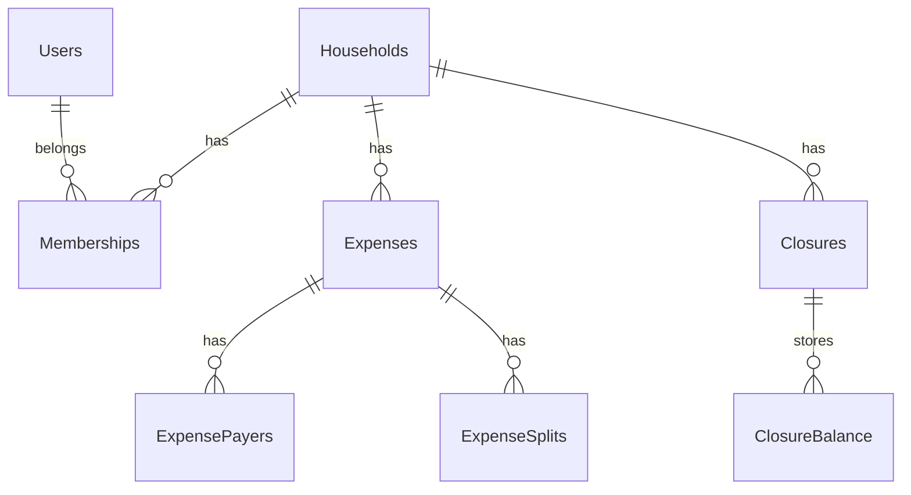

# FinFam Backend API

Backend de FinFam para gestion colaborativa de gastos por hogar: autenticacion con sesiones, invitaciones, registro de gastos con payers/splits, cierre de periodos y calculo de deudas.

## Caracteristicas principales

- Gestion de hogares con roles de membresia (`ADMIN` y `GUEST`)
- Autenticacion JWT con refresh token por cookie HTTP-only
- Verificacion de email y recuperacion de contraseña
- Registro de gastos con validacion de integridad financiera
- Motor de balance para calcular deudas minimizando transacciones
- Cierre de periodos con persistencia de balances historicos
- Carga de comprobantes en Cloudinary
- Cache y flujos temporales en Redis (invitaciones/sesion)

## Stack tecnico

- NestJS 11 + TypeScript
- Prisma ORM + PostgreSQL
- Redis + cache-manager
- Passport + JWT
- Jest + Supertest
- Docker + Docker Compose
- GitHub Actions para CI basico

## Arquitectura modular

- `auth`: login/register, refresh, logout, verify-email, reset-password
- `users`: operaciones de usuario
- `home` y `member`: hogares, roles, membresias activas
- `invitation`: invitaciones por email con TTL en Redis
- `expenses`: CRUD de gastos, payers/splits, validaciones financieras
- `balance-engine`: calculo de balances y deudas
- `closure`: cierre de periodos y snapshot de balances
- `cloudinary`: subida/eliminacion de comprobantes
- `email`: envio de emails transaccionales

## Logica de negocio clave

### Integridad financiera de gastos

Para crear/actualizar un gasto, el sistema valida:

- suma(payers.amountPaid) = amount
- suma(splits.amount) = amount

La comparacion se hace por centavos para evitar errores de punto flotante.

### Cierre de periodos

Al cerrar un hogar:

1. Se valida membresia activa y rol `ADMIN`
2. Se toma el rango de gastos abiertos
3. Se calcula settlement con `balance-engine`
4. Se ejecuta una transaccion Prisma:

- crear closure
- guardar balances
- marcar gastos con `closureId`

### Auth y sesiones

1. Login/Register retorna `access_token`
2. Refresh token via cookie HTTP-only
3. Guards por JWT y por rol/membresia
4. Logout invalida sesion actual

## Modelo de dominio (resumen)



## API

- Swagger: `/docs`
- Resumen de entradas/salidas: ver [ENDPOINTS_IO.md](ENDPOINTS_IO.md)
- Base path: `/api/v1`

## Variables de entorno

Referencia base en [.env.example](.env.example).

Variables requeridas:

- `PORT`
- `ALLOWED_ORIGINS`
- `DATABASE_URL`
- `JWT_SECRET`
- `REDIS_HOST`, `REDIS_PORT`, `REDIS_TTL`
- `EMAIL_FROM`, `EMAIL_PASSWORD`
- `FRONTEND_URL`
- `NODE_ENV` (`development` o `production`)
- `CLOUDINARY_CLOUD_NAME`, `CLOUDINARY_API_KEY`, `CLOUDINARY_API_SECRET`

## Setup local

1. Instalar dependencias

```bash
pnpm install
```

1. Crear archivo de entorno

```bash
cp .env.example .env
```

1. Levantar infraestructura local

```bash
docker compose up -d postgres auth-redis
```

1. Aplicar migraciones y generar cliente Prisma

```bash
pnpm prisma migrate deploy
pnpm prisma generate
```

1. Levantar backend

```bash
pnpm start:dev
```

## Comandos utiles

```bash
pnpm build
pnpm lint
pnpm lint:check
pnpm format
pnpm format:check
pnpm type-check
pnpm test
pnpm test:ci
pnpm test:e2e
pnpm test:e2e:ci
```

## CI basico (GitHub Actions)

Workflow en [.github/workflows/ci.yml](.github/workflows/ci.yml).

Jobs:

- `quality`: lint + format check + type-check
- `build`: prisma generate + build
- `unit-tests`: tests unitarios con cobertura
- `e2e-tests`: e2e con Postgres/Redis efimeros
- `security-audit`: auditoria de dependencias (no bloqueante)

Nota: los unit tests nuevos de modulos criticos se ejecutan aislados con mocks, sin requerir servicios externos ni keys reales.

## Estado de pruebas y prioridades

Pruebas unitarias P0 agregadas:

- `ExpensesService`: validacion de integridad financiera
- `ClosureService`: cierre transaccional y error sin gastos abiertos

Prioridad siguiente recomendada:

1. `InvitationService` (TTL, duplicados, aceptar/declinar)
2. `HomesService` (membresias activas y visibilidad)
3. `MemberService` (proteccion de ultimo admin)
4. `AuthService` (flujos de sesion y tokens)

## Despliegue

### Docker

```bash
docker build -t finfam-backend .
docker run --env-file .env -p 3000:3000 finfam-backend
```

### Docker Compose

```bash
docker compose up -d
```

## Seguridad y buenas practicas

- No subir secretos reales a git
- Mantener `.env` fuera de versionado
- Rotar `JWT_SECRET` y credenciales periodicamente
- Proteger rama principal con CI obligatorio
